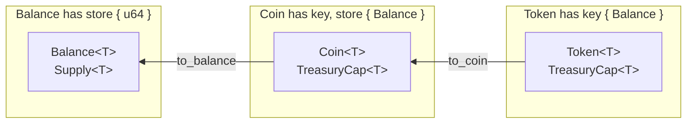
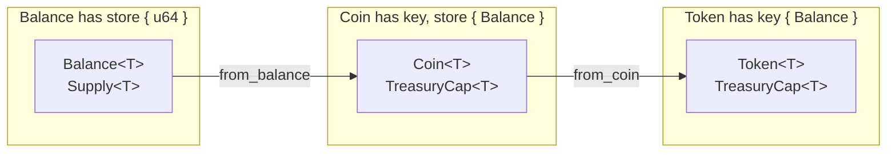

# In-App Token

Many applications have built-in tokens for in-app consumption scenarios. If a [universal Coin token standard](https://docs.sui.io/standards/coin) is used, there is a possibility that users may add them to exchanges for circulation without permission, which can also be troublesome. A technical solution that is well worth understanding is the [Token standard](https://docs.sui.io/standards/closed-loop-token). Tokens can be restricted to usage within the application, such as whether they can be transferred, consumed, and whether they can be converted into Coins in the future, making them very suitable as in-app tokens.

## Basic Concepts of Token

The data structures of `Token`, `Coin`, and `Balance` can be converted with each other.



The `Coin` data structure includes `key` and `store` capabilities when defined, and in the previous lesson, it belongs to Objects that can be freely transferred and traded, while the `Token` data structure definition only includes `key` capability, so it cannot be freely transferred and can be restricted to certain usage scenarios.

```rust
// defined in `sui::coin`
struct Coin<phantom T> has key, store { id: UID, balance: Balance<T> }

// defined in `sui::token`
struct Token<phantom T> has key { id: UID, balance: Balance<T> }
```

In `Token`, there are four operations that are restricted:
- `token::transfer` - Transfers `Token` to another address
- `token::to_coin` - Converts `Token` to `Coin`
- `token::from_coin` - Converts `Coin` to `Token`
- `token::spend` - Spends `Token`

These four operations generate the data structure of `ActionRequest<T>`. For example, see the definition of the `token::spend` function.
`public fun spend<T>(t: Token<T>, ctx: &mut TxContext): ActionRequest<T>`  
`ActionRequest<T>` is a data structure that belongs to the [Hot Potato pattern](https://move-book.com/programmability/hot-potato-pattern.html). It must be decomposed by subsequent functions; otherwise, it will block the function's execution and roll back.

In the [`token` module](https://github.com/MystenLabs/sui/blob/main/crates/sui-framework/packages/sui-framework/sources/token.move), `TreasuryCap`, `TokenPolicy`, and `TokenPolicyCap` are provided, along with corresponding functions and methods to decompose `ActionRequest<T>`.

There are many ways to use them, supporting many flexible customization methods. This section of the tutorial provides a simple [code example](../example_projects/app_token/sources).

## Example Explanation

The complete code is [here](../example_projects/app_token/sources).

### Importing Modules
When our project becomes complex, it is necessary to divide the code into different modules. This example code is the first modular code to appear in this series of courses. The `/sources` directory divides the code into two modules.

```
sources
├── app_token.move
├── profile.move
```
`profile.move` uses the previous example code, including creating `Profile` and checking in once per epoch, which needs to be used within the `app_token.move` module.
So, to refer to the methods of `Profile.move` within the `app_token.move` module, use the `use` declaration.
```
use app_token::profile::{Self, Profile};
```
This indicates that the `Self` and `Profile` data structures of the `profile` module under the `app_token` package are imported, where `Self` represents the entire `profile` module. Subsequently, when using the `click` function of the `profile` module, use the format `profile::click(arg, ctx);`.

To use the `token` feature, it is also necessary to import some related modules from the Sui standard library.

```rust
use sui::{
    coin::{Self, TreasuryCap},
    token::{Self, TokenPolicy, Token}
};
```

### Initialization

```rust
const DECIMALS: u8 = 0;
const SYMBOLS: vector<u8> = b"APP";
const NAME: vector<u8> = b"App";
const DESCRIPTION: vector<u8> = b"Token for Application";
const ICON_URL: vector<u8> = b"https://";  // Coin / Token Icon

public struct APP has drop {}

public struct AdminCap has key, store {
    id: UID,
}

public struct AppTokenCap has key {
    id: UID,
    cap: TreasuryCap<APP>,
}

fun init(otw: APP, ctx: &mut TxContext) {
    let deployer = ctx.sender();
    let admin_cap = AdminCap { id: object::new(ctx) };
    transfer::public_transfer(admin_cap, deployer);

    let (treasury_cap, metadata) = coin::create_currency<APP>(
        otw,
        DECIMALS,
        SYMBOLS, 
        NAME, 
        DESCRIPTION, 
        option::some(new_unsafe_from_bytes(ICON_URL)), 
        ctx
    );

    let (mut policy, cap) = token::new_policy<APP>(
        &treasury_cap, ctx
    );

    let token_cap = AppTokenCap {
        id: object::new(ctx),
        cap: treasury_cap,
    };

    token::allow(&mut policy, &cap, token::spend_action(), ctx);
    token::share_policy<APP>(policy);
    transfer::share_object(token_cap);
    transfer::public_transfer(cap, deployer);
    transfer::public_freeze_object(metadata);
}
```

`TreasuryCap` comes from the `sui::coin` module and is created directly using the `coin::create_currency<T>` method. The returned metadata is data that records token icons, ticks, and other information, which can be frozen if it is not changed anymore.

```rust
let (treasury_cap, metadata) = coin::create_currency<APP>(
    otw,
    DECIMALS,
    SYMBOLS, 
    NAME, 
    DESCRIPTION, 
    option::some(new_unsafe_from_bytes(ICON_URL)), 
    ctx
);

transfer::public_freeze_object(metadata);
```

In the example code, two scenarios are provided for obtaining and spending `token`.

First, use `TreasuryCap` to create `TokenPolicy` and `TokenPolicyCap`, add support for spending `spend` permissions. Then share `TokenPolicy` and send `TokenPolicyCap` to the contract deployment address.

```rust
let (mut policy, cap) = token::new_policy<APP>(
    &treasury_cap, ctx
);

token::allow(&mut policy, &cap, token::spend_action(), ctx);
token::share_policy<APP>(policy);
transfer::public_transfer(cap, deployer);
```

Define a `AppTokenCap` structure to wrap `TreasuryCap`. This is to prevent anyone from directly using `TreasuryCap` to perform any operation, and can only be called according to the functions and methods defined within this module contract. Finally, share `AppTokenCap`.

```rust
public struct AppTokenCap has key {
    id: UID,
    cap: TreasuryCap<APP>,
}

let token_cap = AppTokenCap {
    id: object::new(ctx),
    cap: treasury_cap,
};

transfer::share_object(token_cap);
```

Define an administrator privilege `AdminCap`, and define a function that can obtain a mutable reference to `TreasuryCap` from `AppTokenCap` through `AdminCap`. Because, in the future, if it is necessary to periodically clear the consumed `Token`, it is still necessary to call the `token::flush` function through `&mut TreasuryCap`.

```rust
public struct AdminCap has key, store {
    id: UID,
}

public fun treasury_borrow_mut(
    _admin: &AdminCap,
    app_token_cap: &mut AppTokenCap,
): &mut TreasuryCap<APP> {
    &mut app_token_cap.cap
}
```

### Obtaining Token

This is the implementation of the function to obtain `token`, `click2earn`.
```rust
public fun click2earn(
    profile: &mut Profile,
    token_cap: &mut AppTokenCap,
    ctx: &mut TxContext
) {
    profile::click(profile, ctx);
    let app_token: Token<APP> = token::mint(&mut token_cap.cap, profile::points(profile), ctx);
    emit(Click2EarnEvent {
        user: ctx.sender(),
        amount: token::value<APP>(&app_token),
    });
    let req: ActionRequest<APP> = token::transfer<APP>(app_token, ctx.sender(), ctx);
    token::confirm_with_treasury_cap<APP>(
        &mut token_cap.cap,
        req,
        ctx
    );
}
```

First, you need to successfully execute the `profile::click(profile, ctx);` function, and then use the `token::mint` method to create `app_token: Token<APP>`. `app_token` is the variable name, and `Token<APP>` is the data format.

When using the `token::transfer` method to transfer `app_token: Token<APP>` to the user's address, it will produce `req: ActionRequest<APP>`.

Finally, use `token::confirm_with_treasury_cap` to decompose `req: ActionRequest<APP>`, and the function will be successfully executed. The first variable of `req: ActionRequest<APP>` is `&mut TreasuryCap<APP>`, which can be entered as `&mut token_cap.cap`, indicating the `cap` attribute of `AppTokenCap`, which is the `TreasuryCap<APP>` wrapped in `AppTokenCap`.

### Spending Token

This is the implementation of the function to spend `token`, `buy`.

```rust
public fun buy(
    payment: Token<APP>,
    price_record: &PriceRecord,
    purchased_record: &mut PurchasedRecord,
    item: String,
    token_prolicy: &mut TokenPolicy<APP>,
    ctx: &mut TxContext
) {
    let price = &price_record.prices[item];
    assert!(token::value<APP>(&payment) == *price, EWrongAmount);
    let req = token::spend(payment, ctx);
    token::confirm_request_mut(token_prolicy, req, ctx);
    table::add<String, bool>(&mut purchased_record.record, item, true);
    emit(BuyEvent {
        buyer: ctx.sender(),
        item,
        price: *price,
    });
}
```

Input parameter description:
- `payment: Token<APP>` - The `Token<APP>` to be spent
- `price_record: &PriceRecord` - Data recording the price of all goods, which is a Shared Object
- `purchased_record: &mut PurchasedRecord` - Each user's unique Object recording purchased product information
- `item: String` - The name of the item to be purchased, String type
- `token_prolicy: &mut TokenPolicy<APP>` - The `TokenPolicy` shared during initialization, which has added the `spend` permission

Get the price of the goods and compare it with the face value of the incoming `Token<APP>`. If it is not consistent, an error will occur.
```rust
let price = &price_record.prices[item];
assert!(token::value<APP>(&payment) == *price, EWrongAmount);
```

```rust
let req: ActionRequest<APP> = token::spend(payment, ctx);
token::confirm_request_mut(token_prolicy, req, ctx);
```

Using the `token::spend` method to spend `Token<APP>` will produce a `req: ActionRequest<APP>` containing `spend` and quantity information.

Since `token_prolicy: &mut TokenPolicy<APP>` has been added with the `spend` permission in the initialization function, `token::confirm_request_mut` can be used to decompose `ActionRequest<APP>` here.

Finally, add a purchase record in `PurchasedRecord`. If it has been purchased before, `table` will prevent duplicate addition of the same `Key`, which will prevent the function from executing and roll back.

```rust
table::add<String, bool>(&mut purchased_record.record, item, true);
```

### Other Features

#### Claiming PurchasedRecord

```rust
public fun get_purchased_record(ctx: &mut TxContext) {
    let record = PurchasedRecord {
        id: object::new(ctx),
        record: table::new<String, bool>(ctx),
    };
    transfer::transfer(record, ctx.sender());
}
```

#### Administrator Setting or Deleting Product Prices

```rust
public fun set_item_price(
    _admin: &AdminCap,
    price_record: &mut PriceRecord,
    item: String,
    price: u64,
) {
    if (table::contains<String, u64>(&price_record.prices, item)) {
        let item_price = &mut price_record.prices[item];
        *item_price = price;
    } else {
        table::add<String, u64>(&mut price_record.prices, item, price);
    };
}

public fun remove_item_price(
    _admin: &AdminCap,
    price_record: &mut PriceRecord,
    item: String,
) {
    table::remove<String, u64>(&mut price_record.prices, item);
}
```

### Homework
Read the [`Token` standard](https://docs.sui.io/standards/closed-loop-token) and the [source code of `sui::token`](https://github.com/MystenLabs/sui/blob/main/crates/sui-framework/packages/sui-framework/sources/token.move).  
Based on the example code of this section, create a new `TokenPolicy` that supports `token::to_coin`. When the `Profile` points reach 100, it supports converting all held `Token<APP>` to `Coin<APP>`, and each conversion will reset the `Profile` points to zero.  
Both `app_token.move` and `profile.move` modules need to add new code, and the `TokenPolicy` that supports `token::to_coin` needs to be wrapped.
